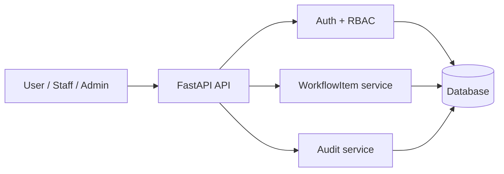
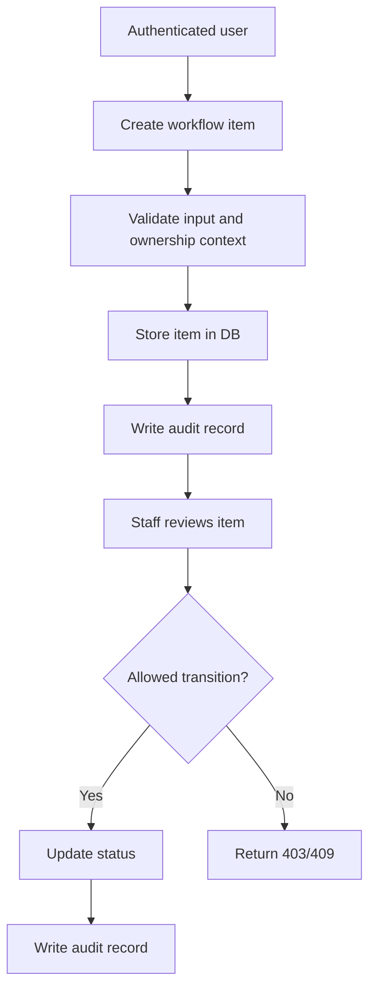

# Universal MVP foundation

## Structural diagram

## Reusable business flow

## Data model

- `users`
  - identities, password hash, role, lockout state
- `workflow_items`
  - core business object with owner, assignee, status, optional amount and payload
- `refresh_tokens`
  - hashed refresh tokens, rotation, expiry, revocation
- `audit_logs`
  - security-relevant action history without secrets

## Security controls already included

- input validation with Pydantic
- server-side RBAC and object-level checks
- hashed passwords with Argon2/Bcrypt support
- short-lived access tokens
- refresh-token rotation and revocation
- neutral error messages for auth failures
- audit logging for critical actions
- request size guard
- secrets from environment instead of source code
- dependency and static analysis tooling
