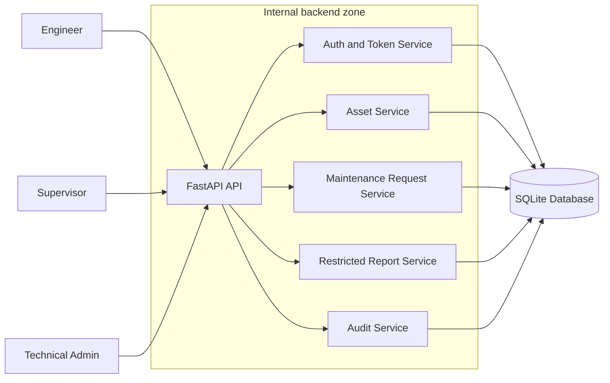
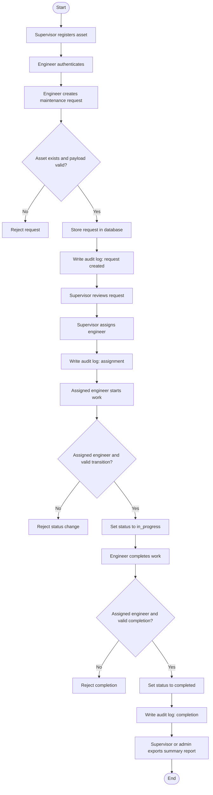
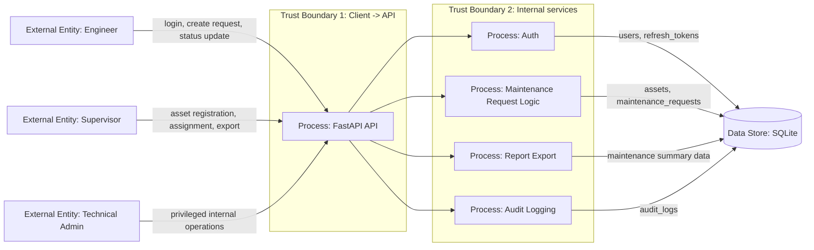

## P3 Required Diagrams

Student: `Nurym Abzal`

Variant: `2`

System: `Oil and gas asset maintenance MVP`

## 1. Which diagrams are required

For `P3`, the safe minimum set for the report is:

- structural architecture diagram
- business-flow diagram for the main scenario
- security-oriented data-flow / trust-boundary diagram

Why this set is correct:

- the assignment requires the MVP architecture and business scenario to be understandable
- the security-analysis part is stronger when the report also shows trust boundaries and protected data flows
- these diagrams map directly to the material from the lectures on threat modeling and secure code review

## 2. Structural architecture diagram

### Purpose

Show the main system components, actors, and the database.

### Recommended notation

This diagram does not need a strict formal standard.
The best fit is a simple block architecture diagram.

Use these shapes:

- actor: plain labeled rectangle or person icon
- service/component: rectangle
- database: cylinder
- trust boundary: dashed container

### Mermaid version

### If you redraw it manually

Use:

- rectangles for `FastAPI API`, `Auth and Token Service`, `Asset Service`, `Maintenance Request Service`, `Restricted Report Service`, `Audit Service`
- cylinder for `SQLite Database`
- dashed outer box for `Internal backend zone`

## 3. Business-flow diagram

### Purpose

Show the exact end-to-end MVP scenario from the assignment.

### Recommended standard

Use a standard flowchart.
This is the most appropriate notation for the assignment scenario.

Use these shapes:

- start/end: terminator (`oval` or rounded capsule)
- action/process: rectangle
- decision/check: diamond
- database write/read: cylinder if shown explicitly
- report/export result: document or rectangle

### Mermaid version

### If you redraw it manually

Use:

- `oval` for `Start` and `End`
- `rectangle` for all user and system actions
- `diamond` for validation and authorization checks
- optional `cylinder` if you want to explicitly show DB persistence after creation and completion

## 4. Security data-flow and trust-boundary diagram

### Purpose

Show where security checks matter: actors, API, DB, internal data, and trust boundaries.

### Recommended standard

For the security section, use a lightweight `DFD` aligned with threat-modeling practice from the lectures.
The closest standard family is `Yourdon/DeMarco` style DFD.

Use these shapes:

- external entity: rectangle
- process: circle or rounded rectangle
- data store: open-ended store or cylinder
- data flow: arrow
- trust boundary: dashed line / dashed container

If Mermaid is used, rounded rectangles plus a cylinder are acceptable as a readable substitute.

### Mermaid version

### What to emphasize in the report text

- boundary between external users and the API
- privileged path to report export
- sensitive stores: `users`, `refresh_tokens`, `audit_logs`, `maintenance_requests`
- server-side authorization before status transitions

## 5. Which notation to prefer in the final report

Use this rule:

- architecture overview: block diagram
- business scenario: standard flowchart
- security analysis: DFD with trust boundaries

This is the cleanest combination for `P3`.

## 6. Shape legend for manual drawing

If you draw the final diagrams in Word, Draw.io, Visio, or PowerPoint, use this legend:

- actor / external entity: rectangle
- process / service / action: rectangle
- decision / validation: diamond
- start / end: oval
- database / persistent storage: cylinder
- document / exported report: document shape
- trust boundary: dashed frame around related elements

## 7. Short compliance note

There is usually no hard requirement in `P3` to use one exact industrial notation everywhere.
What matters is consistency and readability.

So the safest presentation is:

- keep the business process in classic flowchart notation
- keep the security diagram in DFD-style notation
- keep the architecture overview as a block scheme
